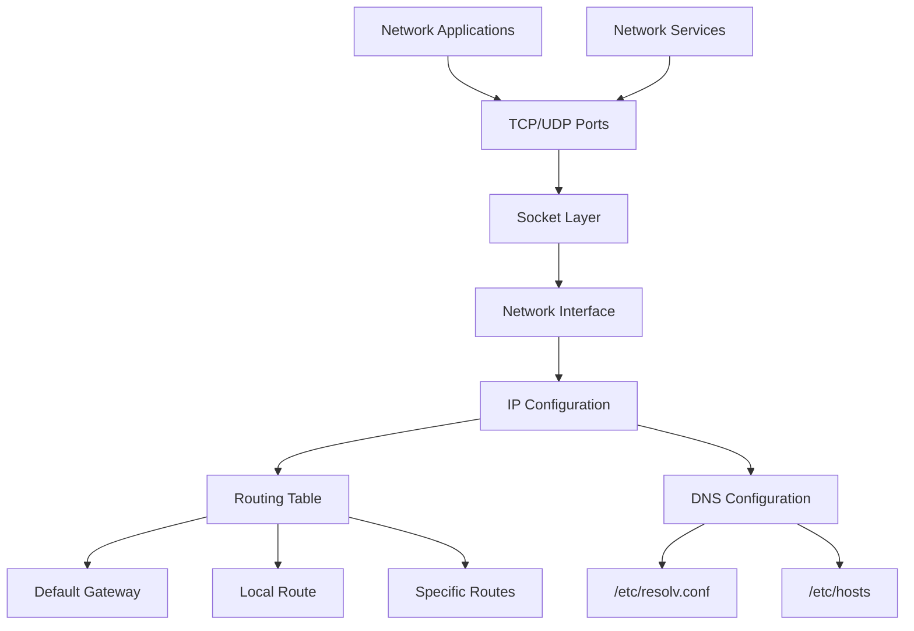

# Linux Basics: Networking

## Table of Contents
1. [DNS (Domain Name System)](#dns-domain-name-system)
   - [DNS Configuration Files](#dns-configuration-files)
   - [DNS Lookup Tools](#dns-lookup-tools)
   - [Configuring DNS Clients](#configuring-dns-clients)
2. [Networking Basics](#networking-basics)
   - [Network Interfaces](#network-interfaces)
   - [IP Addressing](#ip-addressing)
   - [Subnet Masks and CIDR Notation](#subnet-masks-and-cidr-notation)
   - [Network Configuration Files](#network-configuration-files)
3. [Routing](#routing)
   - [Viewing the Routing Table](#viewing-the-routing-table)
   - [Adding and Removing Routes](#adding-and-removing-routes)
   - [Default Gateway Configuration](#default-gateway-configuration)
4. [Troubleshooting Commands](#troubleshooting-commands)
   - [Connectivity Testing](#connectivity-testing)
   - [Network Diagnostics](#network-diagnostics)
   - [Traffic Analysis](#traffic-analysis)
   - [Common Network Issues and Solutions](#common-network-issues-and-solutions)

## DNS (Domain Name System)

The Domain Name System (DNS) is a hierarchical naming system for computers, services, or other resources connected to the Internet or a private network. It translates human-readable domain names (like www.example.com) to IP addresses (like 192.0.2.1) that computers use to identify each other.

### DNS Configuration Files

In Linux, several files are used to configure DNS:

| File | Purpose |
|------|---------|
| `/etc/hosts` | Local hostname to IP mapping |
| `/etc/resolv.conf` | DNS resolver configuration |
| `/etc/nsswitch.conf` | Order of name resolution methods |

#### /etc/hosts

The `/etc/hosts` file is a simple text file that maps hostnames to IP addresses. It's often used for local name resolution before DNS servers are queried.

```
# Example /etc/hosts file
127.0.0.1       localhost
192.168.1.10    server1.local server1
192.168.1.11    server2.local server2
```

#### /etc/resolv.conf

The `/etc/resolv.conf` file specifies the DNS servers to be queried and other DNS-related settings.

```
# Example /etc/resolv.conf file
search example.com local
nameserver 8.8.8.8
nameserver 8.8.4.4
options timeout:2 attempts:3
```

Key directives in `/etc/resolv.conf`:

- `nameserver`: IP address of a DNS server
- `search`: List of domains to search when resolving hostnames
- `domain`: Default domain name (alternative to search)
- `options`: Additional resolver options

```bash
# Adding entries to /etc/resolv.conf
cat >> /etc/resolv.conf << EOF
nameserver 8.8.8.8
nameserver 8.8.4.4
EOF

# On systems using systemd-resolved or NetworkManager, use these commands instead:
sudo systemd-resolve --set-dns=8.8.8.8 --interface=eth0
sudo nmcli con mod "Ethernet connection 1" ipv4.dns "8.8.8.8 8.8.4.4"
```

### DNS Lookup Tools

Linux provides several utilities for DNS lookups and diagnostics:

#### nslookup

The `nslookup` command is a basic DNS query tool:

```bash
# Basic usage
nslookup example.com                # Query A record for example.com
nslookup -type=mx example.com       # Query MX records
nslookup example.com 8.8.8.8        # Query using specific DNS server

# Interactive mode
nslookup
> set type=any
> example.com
> exit
```

#### dig (Domain Information Groper)

The `dig` command is a more powerful and flexible DNS query tool:

```bash
# Basic dig usage
dig example.com                     # Query A record
dig example.com MX                  # Query MX records
dig @8.8.8.8 example.com            # Query using specific DNS server
dig +short example.com              # Short answer only
dig +trace example.com              # Trace the DNS lookup path
dig -x 8.8.8.8                      # Reverse DNS lookup
dig ANY example.com                 # Query all record types

# Batch mode
dig example.com example.org +noall +answer
```

#### host

The `host` command is a simpler alternative to `dig`:

```bash
# Basic host usage
host example.com                    # Basic lookup
host -t MX example.com              # Query specific record type
host -a example.com                 # Query all records
host 93.184.216.34                  # Reverse lookup
```

### Configuring DNS Clients

Most modern Linux distributions use one of several methods to configure DNS:

#### systemd-resolved

For systems using systemd:

```bash
# Check status
systemctl status systemd-resolved

# Configure DNS servers
sudo nano /etc/systemd/resolved.conf
# Add: DNS=8.8.8.8 8.8.4.4

# Apply changes
sudo systemctl restart systemd-resolved
```

#### NetworkManager

For desktop and many server distributions:

```bash
# List connections
nmcli connection show

# Set DNS for a connection
sudo nmcli con mod "Ethernet connection 1" ipv4.dns "8.8.8.8 8.8.4.4"

# Apply changes
sudo nmcli con up "Ethernet connection 1"
```

#### Manual Configuration

For systems not using the above methods:

```bash
# Edit the resolver configuration
sudo nano /etc/resolv.conf

# Make the file immutable to prevent automatic changes
sudo chattr +i /etc/resolv.conf
```

## Networking Basics

Understanding network interfaces, IP addressing, and basic configuration is essential for managing Linux systems.

### Network Interfaces

Network interfaces are connection points between a computer and a network. They can be physical (like Ethernet cards) or virtual (like loopback or VPN interfaces).

#### Viewing Network Interfaces

```bash
# List all interfaces
ip link show                 # Modern command
ifconfig -a                  # Legacy command

# Get detailed information about a specific interface
ip link show dev eth0
ethtool eth0                 # Hardware information
```

#### Managing Network Interfaces

```bash
# Bring an interface up/down using ip command
sudo ip link set dev eth0 up
sudo ip link set dev eth0 down

# Bring an interface up/down using ifconfig (legacy)
sudo ifconfig eth0 up
sudo ifconfig eth0 down

# Restart networking service
sudo systemctl restart networking       # Debian/Ubuntu
sudo systemctl restart network          # RHEL/CentOS
```

### IP Addressing

IP addresses uniquely identify devices on a network. IPv4 addresses are 32-bit numbers typically written as four octets (e.g., 192.168.1.10).

#### Viewing IP Addresses

```bash
# View IP addresses of all interfaces
ip addr show                 # Modern command
ifconfig                     # Legacy command

# View IP address of a specific interface
ip addr show dev eth0
ifconfig eth0
```

#### Assigning IP Addresses

```bash
# Temporary IP address assignment (until reboot)
sudo ip addr add 192.168.1.10/24 dev eth0
sudo ip addr del 192.168.1.10/24 dev eth0

# Legacy method with ifconfig
sudo ifconfig eth0 192.168.1.10 netmask 255.255.255.0
```

### Subnet Masks and CIDR Notation

Subnet masks determine which portion of an IP address identifies the network and which portion identifies the host.

CIDR (Classless Inter-Domain Routing) notation is a compact representation of an IP address and its routing prefix.

| CIDR Notation | Subnet Mask | Number of Addresses |
|---------------|-------------|---------------------|
| /24 | 255.255.255.0 | 256 (254 usable) |
| /16 | 255.255.0.0 | 65,536 (65,534 usable) |
| /8 | 255.0.0.0 | 16,777,216 (16,777,214 usable) |
| /27 | 255.255.255.224 | 32 (30 usable) |
| /30 | 255.255.255.252 | 4 (2 usable) |

### Network Configuration Files

Different Linux distributions use different files and methods for network configuration:

#### Debian/Ubuntu

```
/etc/network/interfaces   # Main configuration file
```

Example content:

```
# /etc/network/interfaces example
auto lo
iface lo inet loopback

auto eth0
iface eth0 inet static
    address 192.168.1.10
    netmask 255.255.255.0
    gateway 192.168.1.1
    dns-nameservers 8.8.8.8 8.8.4.4
```

#### RHEL/CentOS/Fedora

```
/etc/sysconfig/network-scripts/ifcfg-eth0   # Interface specific config
```

Example content:

```
# /etc/sysconfig/network-scripts/ifcfg-eth0
DEVICE=eth0
BOOTPROTO=static
IPADDR=192.168.1.10
NETMASK=255.255.255.0
GATEWAY=192.168.1.1
DNS1=8.8.8.8
DNS2=8.8.4.4
ONBOOT=yes
```

#### NetworkManager

Most modern distributions use NetworkManager, which stores configuration in:

```
/etc/NetworkManager/system-connections/   # Connection profiles
```

## Routing

Routing directs network traffic between subnets and networks.

### Viewing the Routing Table

```bash
# Modern command
ip route show                  # or simply: ip r

# Legacy commands
route -n                       # Numerical output
netstat -rn                    # Similar output format
```

Example output:

```
Kernel IP routing table
Destination     Gateway         Genmask         Flags Metric Ref    Use Iface
0.0.0.0         192.168.1.1     0.0.0.0         UG    0      0        0 eth0
192.168.1.0     0.0.0.0         255.255.255.0   U     0      0        0 eth0
```

### Adding and Removing Routes

#### Temporary Routes (until reboot)

```bash
# Add a route to a network
sudo ip route add 192.168.2.0/24 via 192.168.1.1
sudo ip route add 192.168.2.0/24 dev eth0       # Directly connected

# Delete a route
sudo ip route del 192.168.2.0/24

# Legacy commands with route
sudo route add -net 192.168.2.0 netmask 255.255.255.0 gw 192.168.1.1
sudo route del -net 192.168.2.0 netmask 255.255.255.0 gw 192.168.1.1
```

#### Persistent Routes

For Debian/Ubuntu, add to `/etc/network/interfaces`:

```
post-up ip route add 192.168.2.0/24 via 192.168.1.1
```

For RHEL/CentOS, create `/etc/sysconfig/network-scripts/route-eth0`:

```
192.168.2.0/24 via 192.168.1.1
```

### Default Gateway Configuration

The default gateway is used for traffic that doesn't match any other routes.

```bash
# Add default gateway (temporary)
sudo ip route add default via 192.168.1.1
# Alternative syntax
sudo ip route add 0.0.0.0/0 via 192.168.1.1

# Delete default gateway
sudo ip route del default

# Legacy command
sudo route add default gw 192.168.1.1
```

here are specific examples:

```bash
# Add routes for specific networks
sudo ip route add 192.168.2.0/24 via 192.168.1.1

# Add default route/gateway
sudo ip r add default via 172.16.238.1

# Delete default route
sudo ip r del default
```

## Troubleshooting Commands

Linux provides various tools for network troubleshooting and diagnostics.

### Connectivity Testing

#### ping

The `ping` command tests basic connectivity to a host:

```bash
# Basic ping
ping example.com             # Continuous ping (Ctrl+C to stop)
ping -c 4 example.com        # Send only 4 packets
ping -i 0.2 example.com      # Fast ping (0.2 second intervals)
ping -s 1500 example.com     # Use larger packet size (test MTU)
ping -t 10 example.com       # Set TTL to 10
```

#### traceroute/tracepath

These commands show the network path to a destination:

```bash
# Basic usage
traceroute example.com       # Show route with DNS lookups
traceroute -n example.com    # Numeric output only (faster)
tracepath example.com        # Similar but doesn't require root

# Changing protocol
traceroute -I example.com    # Use ICMP instead of UDP
traceroute -T example.com    # Use TCP
```


```bash
traceroute <some ip address>  # Trace the network route to a specific IP
```

#### telnet/nc (netcat)

These tools test connectivity to specific ports:

```bash
# Test TCP connection to a specific port
telnet example.com 80        # Connect to HTTP port
nc -vz example.com 22        # Check SSH port
nc -vz -u example.com 53     # Check UDP port (DNS)
```

### Network Diagnostics

#### ip/ifconfig

Display detailed network interface information:

```bash
# Show all interfaces with addresses
ip addr show                 # Modern command
ifconfig                     # Legacy command

# Check statistics
ip -s link show dev eth0     # Interface statistics
```

#### ss/netstat

Display network connections and socket information:

```bash
# Show all connections
ss -tuln                     # TCP, UDP, listening, numeric
netstat -tuln                # Same with legacy command

# Show processes using connections
ss -tulnp                    # Need root for process info
netstat -tulnp

# Show routing table
ss -r
netstat -r
```

#### mtr (My Traceroute)

Combines ping and traceroute functionality:

```bash
mtr example.com              # Interactive mode
mtr --report example.com     # Report mode (run 10 times)
mtr --report-cycles=3 example.com  # Run 3 cycles only
```

### Traffic Analysis

#### tcpdump

Capture and analyze network traffic:

```bash
# Basic capture
sudo tcpdump -i eth0                    # Capture on specific interface
sudo tcpdump -i any                     # Capture on all interfaces
sudo tcpdump -i eth0 -w capture.pcap    # Save to file

# Filtering traffic
sudo tcpdump host 192.168.1.10          # Traffic to/from specific host
sudo tcpdump port 80                    # HTTP traffic
sudo tcpdump 'tcp port 80 or tcp port 443'  # HTTP and HTTPS
sudo tcpdump net 192.168.1.0/24         # Traffic to/from network
```

#### nmap

Network discovery and security scanning:

```bash
# Basic host discovery
nmap -sn 192.168.1.0/24                # Ping scan (find hosts)

# Port scanning
nmap 192.168.1.10                      # Default scan
nmap -p 22,80,443 192.168.1.10         # Specific ports
nmap -p- 192.168.1.10                  # All ports
nmap -sV 192.168.1.10                  # Version detection
```

### Common Network Issues and Solutions

#### Network connectivity issues

```bash
# Check if interface is up
ip link show dev eth0 
sudo ip link set dev eth0 up

# Check IP address assignment
ip addr show dev eth0
sudo ip addr add 192.168.1.10/24 dev eth0

# Check default gateway
ip route show
sudo ip route add default via 192.168.1.1

# Check DNS configuration
cat /etc/resolv.conf
echo "nameserver 8.8.8.8" | sudo tee /etc/resolv.conf
```

#### Firewall issues

```bash
# Check iptables rules
sudo iptables -L -n -v

# Temporarily disable firewall for testing
sudo iptables -F                         # Flush all rules
sudo ufw disable                         # For Ubuntu
sudo systemctl stop firewalld            # For RHEL/CentOS
```

#### Network performance issues

```bash
# Check interface errors
ip -s link show dev eth0

# Test network speed
iperf3 -c iperf.example.com              # Client mode
iperf3 -s                                # Server mode

# Check for network congestion
ping -c 10 example.com                   # Look for packet loss or high latency
```

#### Routing issues

```bash
# View all routes
ip route show

# Test specific routes
traceroute 192.168.2.10

# Clear route cache
sudo ip route flush cache
```

Here's a diagram that represents how networking components interrelate in Linux:

