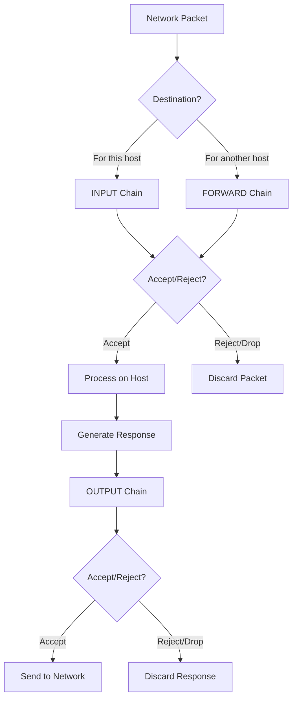

# Linux Security and File Permissions

## Table of Contents
1. [Linux Accounts and Their Types](#linux-accounts-and-their-types)
2. [Access Control Files](#access-control-files)
3. [User Management](#user-management)
4. [File Permissions and Ownership](#file-permissions-and-ownership)
5. [SSH and SCP](#ssh-and-scp)
6. [IPTABLES](#iptables)
7. [IPTABLES - Securing the Environment](#iptables---securing-the-environment)
8. [CRONJOBS](#cron-jobs)

## Linux Accounts and Their Types

Linux is a multi-user operating system that allows multiple users to access and use system resources simultaneously. Understanding the different account types is essential for proper system administration and security management.

### Types of Linux Accounts

1. **User Accounts**
   - Created for regular users
   - Used for daily operations and tasks
   - Each user has a home directory typically under `/home/username`
   - Limited privileges (non-administrative)

2. **Superuser Account (root)**
   - Has User ID (UID) 0
   - Unrestricted access to all system resources
   - Home directory is typically `/root`
   - Used for system administration tasks

3. **System Accounts**
   - Created by the system during installation
   - Used to run system services and daemons
   - Usually have UIDs less than 1000 (varies by distribution)
   - Examples: `nobody`, `sshd`, `apache`, `mysql`

4. **Service Accounts**
   - Similar to system accounts but created for specific applications
   - Help isolate services for security purposes
   - Examples: accounts for web servers, databases, mail services

### Viewing User Information

To view information about users on the system:

```bash
# View all user accounts
cat /etc/passwd

# View all groups
cat /etc/group

# View details about a specific user
id username

# Search for a specific user in the passwd file
grep -i username /etc/passwd

# See who is currently logged in
who

# View login history
last
```

### Switching Between Users

There are two main commands to switch between users:

```bash
# Switch to another user (will prompt for password)
su username

# Switch to root (will prompt for password)
su

# Execute a command as another user with sudo
sudo command

# Switch to another user using sudo
sudo -u username command

# Open a shell as another user with sudo
sudo -i -u username

# Check sudo privileges for a user
sudo grep username /etc/sudoers
```

## Access Control Files

Linux manages user accounts and their security through several critical files:

### 1. /etc/passwd

This file contains basic user account information. Each line represents a user account with fields separated by colons.

Format: `username:password:UID:GID:comment:home_directory:shell`

Example:
```
john:x:1000:1000:John Doe:/home/john:/bin/bash
```

Fields explained:
- `username`: The login name
- `password`: An 'x' indicating password is stored in `/etc/shadow`
- `UID`: User ID number (0 for root, 1-999 for system users, 1000+ for regular users typically)
- `GID`: Primary group ID number
- `comment`: User full name or comment field (GECOS)
- `home_directory`: User's home directory path
- `shell`: Default shell for the user

### 2. /etc/shadow

This file contains encrypted password information and password policy settings.

Format: `username:encrypted_password:lastchange:min:max:warn:inactive:expire:reserved`

Example:
```
john:$6$5cK1F3KY$AYKQIl5vbXlG/SbQr.xKtUwuZ8jVzLQKt9:18762:0:99999:7:30::
```

Fields explained:
- `username`: Same as in `/etc/passwd`
- `encrypted_password`: Encrypted password hash
- `lastchange`: Days since Jan 1, 1970 that password was last changed
- `min`: Minimum days before password can be changed
- `max`: Maximum days password is valid
- `warn`: Days before expiration to warn user
- `inactive`: Days after expiration until account is disabled
- `expire`: Date when account expires (days since Jan 1, 1970)
- `reserved`: Reserved for future use

### 3. /etc/group

This file contains information about groups defined in the system.

Format: `group_name:password:GID:user_list`

Example:
```
developers:x:1011:john,jane,bob
```

Fields explained:
- `group_name`: Name of the group
- `password`: Usually an 'x', group passwords are stored in `/etc/gshadow`
- `GID`: Group ID number
- `user_list`: List of users who are members of the group (comma-separated)

## User Management

### Creating Users

The `useradd` command is used to create new user accounts:

```bash
# Basic user creation
useradd username

# Create user with specific options
useradd -c "Comment" -d /home/dir -e YYYY-MM-DD -g primarygroup -G group1,group2 -s /bin/shell -u UID username
```

Common options:
- `-c` - Add a comment/description (typically full name)
- `-d` - Specify home directory path
- `-e` - Set account expiration date (YYYY-MM-DD format)
- `-g` - Specify primary group (by name or GID)
- `-G` - Specify supplementary groups (comma-separated list)
- `-s` - Specify login shell
- `-u` - Set UID manually

### Setting/Changing Passwords

```bash
# Set password for another user (requires root/sudo)
passwd username

# Change your own password
passwd

# Set password expiration parameters
chage -M days username  # Maximum password age
chage -I days username  # Account inactivity period
chage -E YYYY-MM-DD username  # Account expiration date
chage -l username  # List password aging parameters
```

### Modifying User Accounts

```bash
# Modify user attributes
usermod -c "New Comment" username
usermod -g newgroup username
usermod -G group1,group2 username  # Replace all supplementary groups
usermod -aG group username  # Add user to group without removing from others
usermod -s /bin/newshelll username
usermod -L username  # Lock account
usermod -U username  # Unlock account
```

### Deleting User Accounts

```bash
# Delete user account
userdel username

# Delete user account including home directory and mail spool
userdel -r username
```

### Group Management

```bash
# Create a new group
groupadd groupname
groupadd -g GID groupname

# Example
groupadd -g 1011 developers

# Modify a group
groupmod -n newname oldname
groupmod -g newGID groupname

# Delete a group
groupdel groupname
```

## File Permissions and Ownership

### File Types

In Linux, file types are denoted by the first character in the output of `ls -l`:

- `-` Regular file
- `d` Directory
- `l` Symbolic link
- `c` Character device
- `b` Block device
- `p` Named pipe
- `s` Socket

### Understanding Permissions

Linux file permissions are divided into three categories:
- Owner (u) - The user who owns the file
- Group (g) - The group associated with the file
- Others (o) - Everyone else

Each category can have three permission types:
- Read (r) - View contents (value: 4)
- Write (w) - Modify contents (value: 2)
- Execute (x) - Execute files or access directories (value: 1)

The permission representation in `ls -l` looks like:
```
-rwxr-xr--
```

This breaks down as:
- First character: File type
- Next three characters: Owner permissions
- Next three characters: Group permissions
- Last three characters: Others permissions

### Octal Representation

Permissions can also be represented with octal numbers:
- Read (r) = 4
- Write (w) = 2
- Execute (x) = 1

Adding these values gives the permission for each category:
- rwx = 4+2+1 = 7
- r-x = 4+0+1 = 5
- r-- = 4+0+0 = 4

For example, `rwxr-xr--` in octal is `754`.

### Changing Permissions

```bash
# Using symbolic notation
chmod u+x filename  # Add execute permission for owner
chmod g-w filename  # Remove write permission for group
chmod o=r filename  # Set other's permission to read-only
chmod a+r filename  # Add read permission for all
chmod u+x,g+x,o-rwx filename  # Multiple changes

# Using octal notation
chmod 755 filename  # rwxr-xr-x
chmod 644 filename  # rw-r--r--
chmod 700 filename  # rwx------
chmod 777 filename  # rwxrwxrwx (not recommended for security)

# Apply recursively to directories
chmod -R 755 directory/
```

### Special Permissions

Beyond the basic rwx permissions, Linux supports special permissions:

1. **SUID (Set User ID)** - 4000
   - When set on executable files, runs with the owner's privileges
   - Represented by `s` in the owner's execute position
   - `chmod u+s filename` or `chmod 4755 filename`

2. **SGID (Set Group ID)** - 2000
   - When set on executable files, runs with the group's privileges
   - When set on directories, new files inherit the directory's group
   - Represented by `s` in the group's execute position
   - `chmod g+s filename` or `chmod 2755 filename`

3. **Sticky Bit** - 1000
   - When set on directories, files can only be deleted by their owners
   - Common on shared directories like `/tmp`
   - Represented by `t` in the others' execute position
   - `chmod +t directory` or `chmod 1777 directory`

### Changing Ownership

```bash
# Change the owner of a file
chown username filename

# Change owner and group
chown username:groupname filename

# Change only the group
chgrp groupname filename

# Apply changes recursively
chown -R username:groupname directory/

# Example
sudo chown mercury -R sports/
```

## SSH and SCP

### SSH (Secure Shell)

SSH provides secure encrypted communication between systems.

#### Basic SSH Connection

```bash
# Connect to remote host
ssh hostname_or_ip

# Connect with specific username
ssh username@hostname_or_ip

# Connect using -l flag for username
ssh -l username hostname_or_ip

# Use specific port (default is 22)
ssh -p port username@hostname_or_ip

# Verbose mode for troubleshooting
ssh -v username@hostname_or_ip

# Execute a single command via SSH
ssh username@hostname_or_ip "command"
```

#### Setting Up Password-less SSH Access

This uses public/private key pairs for authentication:

```bash
# Generate SSH key pair (RSA)
ssh-keygen -t rsa

# Generate SSH key pair (Ed25519, more secure)
ssh-keygen -t ed25519

# Specify key file location and name
ssh-keygen -t rsa -f ~/.ssh/id_rsa_server

# Copy public key to remote server
ssh-copy-id username@hostname_or_ip

# Copy with specific port
ssh-copy-id -p port username@hostname_or_ip

# Manual method (if ssh-copy-id is not available)
cat ~/.ssh/id_rsa.pub | ssh username@hostname_or_ip "mkdir -p ~/.ssh && cat >> ~/.ssh/authorized_keys"
```

#### SSH Configuration File

For frequent connections, you can create an SSH config file at `~/.ssh/config`:

```
Host server
    HostName 192.168.1.100
    User username
    Port 22
    IdentityFile ~/.ssh/id_rsa
```

Then connect simply with:
```bash
ssh server
```

### SCP (Secure Copy)

SCP allows secure file transfer between hosts.

```bash
# Copy local file to remote server
scp file.txt username@hostname_or_ip:/remote/directory/

# Copy remote file to local system
scp username@hostname_or_ip:/remote/file.txt /local/directory/

# Copy directory recursively
scp -r local_directory/ username@hostname_or_ip:/remote/directory/

# Preserve file attributes (permissions, timestamps)
scp -p file.txt username@hostname_or_ip:/remote/directory/

# Preserve attributes and copy recursively
scp -pr local_directory/ username@hostname_or_ip:/remote/directory/

# Example
sudo scp -pr /home/bob/caleston-code.tar.gz bob@devapp01:/home/bob/
```

## IPTABLES

IPTABLES is a powerful firewall utility for Linux systems that allows system administrators to configure the IP packet filter rules.

### IPTABLES Concepts

IPTABLES operates using the following concepts:

1. **Tables** - Sets of chains (default is 'filter')
   - `filter` - Default table for filtering packets
   - `nat` - Used for network address translation
   - `mangle` - Used for specialized packet alteration
   - `raw` - Used for configuring exemptions from connection tracking

2. **Chains** - Series of rules for packets
   - `INPUT` - For packets coming into the system
   - `OUTPUT` - For packets leaving the system
   - `FORWARD` - For packets being routed through the system

3. **Targets** - Actions taken when a rule matches
   - `ACCEPT` - Allow the packet
   - `DROP` - Discard the packet
   - `REJECT` - Discard the packet and notify the sender
   - `LOG` - Log the packet

### Basic IPTABLES Commands

```bash
# Installation (for Ubuntu/Debian)
sudo apt install iptables

# Installation (for CentOS/RHEL, typically pre-installed)
sudo yum install iptables-services

# List all rules
sudo iptables -L

# List rules with line numbers and details
sudo iptables -L -v --line-numbers

# List rules for a specific chain
sudo iptables -L INPUT

# Flush (delete) all rules
sudo iptables -F
```

### Rule Structure

The general syntax for adding rules is:

```bash
iptables -A CHAIN -p PROTOCOL -s SOURCE --sport SOURCE_PORT -d DESTINATION --dport DESTINATION_PORT -j TARGET
```

Where:
- `-A` - Append rule to end of chain
- `-I` - Insert rule at beginning of chain
- `-p` - Protocol (tcp, udp, icmp, all)
- `-s` - Source address/network
- `--sport` - Source port
- `-d` - Destination address/network
- `--dport` - Destination port
- `-j` - Jump to target/action

## IPTables - Securing the Environment

### Understanding IPTables Components

IPTables is a user-space utility program that allows a system administrator to configure the IP packet filter rules in the Linux kernel firewall. It's the standard firewall tool for Linux systems, particularly in enterprise environments.

IPTables works by filtering packets based on a set of rules organized into tables:

- **Filter table**: The default table for packet filtering
- **NAT table**: Used for Network Address Translation
- **Mangle table**: For specialized packet alteration
- **Raw table**: Used to configure exemptions from connection tracking
- **Security table**: Used for Mandatory Access Control networking rules

Each table contains several built-in chains, and administrators can create custom chains as needed.

### IPTables Chains

IPTables organizes rules into chains. The three primary chains in the filter table are:

1. **INPUT**: Controls incoming packets to the system
2. **FORWARD**: Filters packets that are routed through the system
3. **OUTPUT**: Filters packets leaving the system

Understanding these chains is crucial for effective firewall management:



### Common IPTables Commands

#### Installation

IPTables is installed by default on most Red Hat and CentOS distributions. For Ubuntu:

```bash
sudo apt install iptables
```

#### Listing Rules

To list all current rules:

```bash
sudo iptables -L
sudo iptables -L --line-numbers  # With line numbers
sudo iptables -L -v              # Verbose output with packet counters
```

#### Basic Rule Syntax

The general syntax for adding rules is:

```bash
iptables -A CHAIN -p PROTOCOL -s SOURCE --dport DESTINATION_PORT -j ACTION
```

Where:
- `-A`: Appends a rule to the end of the specified chain
- `-p`: Specifies the protocol (tcp, udp, icmp)
- `-s`: Specifies the source address
- `--dport`: Specifies the destination port
- `-j`: Specifies the target action (ACCEPT, DROP, REJECT)

Additional common options:
- `-I`: Insert a rule at a specific position
- `-D`: Delete a rule
- `-F`: Flush (delete) all rules in a chain
- `-P`: Set the default policy for a chain

### Practical Examples

Let's look at some practical examples and expand on them:

#### Allowing Specific SSH Connections

Allow SSH access from a specific IP address and block all others:

```bash
# Allow SSH access from 172.168.238.187
iptables -A INPUT -p tcp -s 172.168.238.187 --dport 22 -j ACCEPT

# Drop all other SSH connection attempts
iptables -A INPUT -p tcp --dport 22 -j DROP
```

#### Securing a System by Default

Implement a default deny policy for incoming traffic:

```bash
# Drop all incoming connections by default
sudo iptables -A INPUT -j DROP
```

**Note**: Implementing this rule alone will block all incoming connections, including SSH. Make sure to add rules allowing necessary connections before this rule.

#### Controlling Outbound Traffic

Allowing specific outbound connections while blocking others:

```bash
# Allow PostgreSQL connections to specific database server
sudo iptables -A OUTPUT -d devdb01 -p tcp --dport 5432 -j ACCEPT

# Allow HTTP access to repository server
sudo iptables -A OUTPUT -d caleston-repo-01 -p tcp --dport 80 -j ACCEPT
# Or with IP address
sudo iptables -A OUTPUT -d 172.16.238.15 -p tcp --dport 80 -j ACCEPT

# Block outgoing HTTP traffic to any other destination
sudo iptables -A OUTPUT -p tcp --dport 80 -j DROP

# Block outgoing HTTPS traffic
sudo iptables -A OUTPUT -p tcp --dport 443 -j DROP
```

#### Inserting Rules at the Beginning

Insert a rule at the top of the chain to ensure it's processed first:

```bash
# Allow HTTPS connections to Google.com
sudo iptables -I OUTPUT -d google.com -p tcp --dport 443 -j ACCEPT
```

#### Saving IPTables Rules

IPTables rules are cleared upon system reboot unless you save them:

For Debian/Ubuntu:
```bash
sudo netfilter-persistent save
```

For CentOS/RHEL:
```bash
sudo service iptables save
```

### Best Practices for Firewall Configuration

1. **Default Deny Policy**: Start with a "deny all" approach, then allow only necessary services.
2. **Explicit Rules**: Be explicit about what you're allowing or denying.
3. **Order Matters**: Rules are processed in order; place more specific rules before general ones.
4. **Test Thoroughly**: Test rules before implementing them in production.
5. **Document Rules**: Document the purpose of each rule for future reference.
6. **Regular Audits**: Regularly review and cleanup unnecessary rules.
7. **Use Comments**: Add comments to rules for better documentation:
   ```bash
   iptables -A INPUT -p tcp --dport 80 -j ACCEPT -m comment --comment "Allow HTTP traffic"
   ```

## Cron Jobs

Cron is a time-based job scheduler in Unix-like operating systems. It enables users to schedule commands or scripts to run automatically at specified times, dates, or intervals.

### Understanding Cron Syntax

A cron job uses the following format:

```
* * * * * command_to_execute
│ │ │ │ │
│ │ │ │ └─── Day of the week (0-6) (Sunday=0)
│ │ │ └───── Month (1-12)
│ │ └─────── Day of the month (1-31)
│ └───────── Hour (0-23)
└─────────── Minute (0-59)
```

Common special characters:
- `*`: Any value
- `,`: Value list separator (e.g., "1,3,5")
- `-`: Range of values (e.g., "1-5")
- `/`: Step values (e.g., "*/2" means every 2 units)

Special strings:
- `@reboot`: Run once at startup
- `@yearly` or `@annually`: Run once a year (0 0 1 1 *)
- `@monthly`: Run once a month (0 0 1 * *)
- `@weekly`: Run once a week (0 0 * * 0)
- `@daily` or `@midnight`: Run once a day (0 0 * * *)
- `@hourly`: Run once an hour (0 * * * *)

### Managing Cron Jobs

#### User Crontabs

Each user can have their own crontab file:

```bash
# Edit current user's crontab
crontab -e

# List current user's crontab
crontab -l

# Remove current user's crontab
crontab -r
```

#### System-wide Crontabs

System-wide cron jobs can be configured in:
- `/etc/crontab`: System-wide crontab
- `/etc/cron.d/`: Directory containing additional crontab files
- `/etc/cron.hourly/`, `/etc/cron.daily/`, `/etc/cron.weekly/`, `/etc/cron.monthly/`: Directories for scripts to be run at specified intervals

#### Format for system-wide crontab

System crontab entries include the user field:

```
* * * * * user command_to_execute
```

### Common Use Cases

1. **System Maintenance**:
   ```bash
   # Run system updates daily at 3 AM
   0 3 * * * apt update && apt upgrade -y
   ```

2. **Log Rotation**:
   ```bash
   # Rotate logs at midnight
   0 0 * * * /usr/sbin/logrotate /etc/logrotate.conf
   ```

3. **Database Backups**:
   ```bash
   # Backup database every day at 2 AM
   0 2 * * * /usr/local/bin/backup_database.sh
   ```

4. **Monitoring**:
   ```bash
   # Check disk space every hour
   0 * * * * /usr/local/bin/check_disk_space.sh
   ```

5. **Clean Temporary Files**:
   ```bash
   # Clean /tmp directory weekly
   0 0 * * 0 find /tmp -type f -atime +7 -delete
   ```

### Security Considerations

1. **Restrict Access**: Limit who can create cron jobs using `/etc/cron.allow` and `/etc/cron.deny`.
2. **Validate Input**: Sanitize any input used in cron jobs to prevent injection attacks.
3. **Use Absolute Paths**: Always use absolute paths in cron jobs to avoid path-related issues.
4. **Redirect Output**: Redirect output to logs for troubleshooting:
   ```bash
   0 * * * * /path/to/script.sh > /var/log/cron_script.log 2>&1
   ```
5. **Use Least Privilege**: Run cron jobs with the minimum required privileges.

### Troubleshooting Cron Jobs

1. **Check Cron Service**:
   ```bash
   systemctl status cron    # For Debian/Ubuntu
   systemctl status crond   # For CentOS/RHEL
   ```

2. **Verify Cron Logs**:
   ```bash
   grep cron /var/log/syslog    # For Debian/Ubuntu
   grep crond /var/log/messages # For CentOS/RHEL
   ```

3. **Test Commands Manually**: Run commands manually to verify they work before scheduling them.

4. **Common Issues**:
   - Environment variables not set in cron environment
   - PATH differences between interactive shell and cron environment
   - Permissions issues for files or directories
   - Syntax errors in crontab entries

5. **Debugging Tips**:
   - Add environment settings at the top of crontab
   - Redirect output to a file for inspection
   - Use absolute paths for all commands and files
   - Test your script with the limited environment variables available to cron