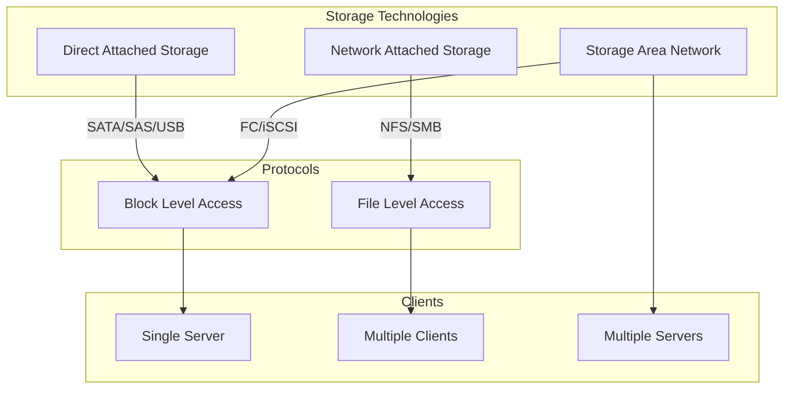
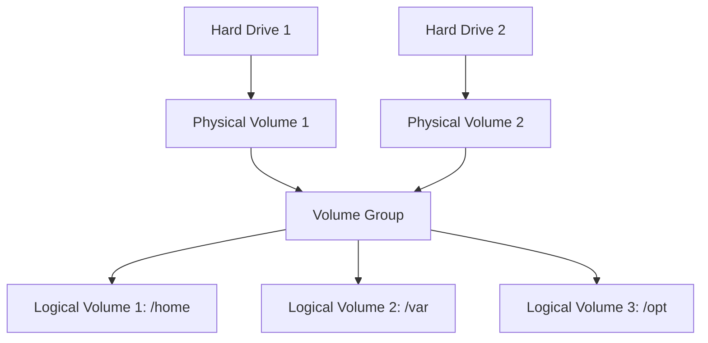

# Linux Storage Management

## Table of Contents
1. [Introduction](#introduction)
2. [Disk Partitions](#disk-partitions)
   - [Partition Types](#partition-types)
   - [Partitioning Schemes](#partitioning-schemes)
   - [Partition Management Tools](#partition-management-tools)
   - [Creating and Managing Partitions](#creating-and-managing-partitions)
3. [File Systems in Linux](#file-systems-in-linux)
   - [Common File Systems](#common-file-systems)
   - [File System Creation and Management](#file-system-creation-and-management)
   - [Mounting File Systems](#mounting-file-systems)
   - [Persistent Mounts with /etc/fstab](#persistent-mounts-with-etcfstab)
4. [Storage Technologies](#storage-technologies)
   - [DAS (Direct Attached Storage)](#das-direct-attached-storage)
   - [NAS (Network Attached Storage)](#nas-network-attached-storage)
   - [SAN (Storage Area Network)](#san-storage-area-network)
   - [Comparison of Storage Technologies](#comparison-of-storage-technologies)
5. [NFS (Network File System)](#nfs-network-file-system)
   - [NFS Server Configuration](#nfs-server-configuration)
   - [NFS Client Configuration](#nfs-client-configuration)
   - [NFS Security Considerations](#nfs-security-considerations)
6. [LVM (Logical Volume Management)](#lvm-logical-volume-management)
   - [LVM Concepts](#lvm-concepts)
   - [Creating and Managing Physical Volumes](#creating-and-managing-physical-volumes)
   - [Creating and Managing Volume Groups](#creating-and-managing-volume-groups)
   - [Creating and Managing Logical Volumes](#creating-and-managing-logical-volumes)
   - [Extending and Reducing Volumes](#extending-and-reducing-volumes)
   - [LVM Snapshots](#lvm-snapshots)

## Introduction

Storage management is a critical aspect of Linux system administration. This README covers the essential components of Linux storage management, including disk partitioning, file systems, storage technologies, network file systems, and logical volume management (LVM).

Understanding these concepts allows system administrators to efficiently organize, secure, and manage data storage in Linux environments, from single servers to complex enterprise infrastructures.

## Disk Partitions

A disk partition is a logical division of a physical storage device that functions as though it were a separate disk. Partitioning helps organize data, separate operating systems, and improve data management.

### Partition Types

Based on standard Linux partitioning practices, there are three main types of partitions:

1. **Primary Partitions**: 
   - Can be bootable
   - Limited to a maximum of 4 per disk in MBR partitioning scheme
   - Directly recognized by the operating system

2. **Extended Partitions**:
   - A special type of primary partition that acts as a container
   - Can only have one extended partition per disk
   - Cannot directly store data itself
   - Used to create multiple logical partitions beyond the 4 primary partition limit

3. **Logical Partitions**:
   - Created within an extended partition
   - Not directly bootable
   - Used to overcome the 4 primary partition limit
   - Numbered starting from 5 (e.g., sda5, sda6, etc.)

### Partitioning Schemes

There are two primary partitioning schemes in Linux:

1. **MBR (Master Boot Record)**:
   - Traditional partitioning scheme
   - Supports up to 4 primary partitions or 3 primary + 1 extended
   - Maximum partition size of 2TB
   - Maximum disk size of 2TB
   - Uses 32-bit addressing

2. **GPT (GUID Partition Table)**:
   - Modern partitioning scheme
   - Part of the UEFI (Unified Extensible Firmware Interface) standard
   - Supports up to 128 partitions by default
   - Maximum partition size of 18 exabytes (theoretical)
   - Uses 64-bit addressing
   - Includes backup partition tables for improved reliability
   - Stores cyclic redundancy check (CRC) values to detect errors

### Partition Management Tools

Linux provides several tools for disk partitioning:

1. **fdisk**:
   - Traditional partitioning tool
   - Limited to MBR partitioning
   - Cannot handle disks larger than 2TB
   - Command: `sudo fdisk -l /dev/sda`

2. **gdisk**:
   - GPT-aware version of fdisk
   - Used for GPT partitioning
   - Command: `sudo gdisk /dev/sda`

3. **parted**:
   - Versatile tool that supports both MBR and GPT
   - Can resize partitions
   - Command: `sudo parted /dev/sda print`

4. **gparted**:
   - Graphical version of parted
   - User-friendly interface
   - Command: `sudo gparted`

### Creating and Managing Partitions

#### Listing Block Devices and Partitions

To list all block devices:

```bash
lsblk
```

To show detailed information about partitions:

```bash
sudo fdisk -l
# or for a specific device
sudo fdisk -l /dev/sda
```

#### Creating Partitions with fdisk

```bash
# Start fdisk for the device
sudo fdisk /dev/sdb

# Commands within fdisk:
# m - display help
# n - create new partition
# p - create primary partition
# e - create extended partition
# l - create logical partition
# t - change partition type
# w - write changes to disk
# q - quit without saving changes
```

#### Creating Partitions with gdisk (for GPT)

```bash
# Start gdisk for the device
sudo gdisk /dev/sdb

# Commands are similar to fdisk
# ? - display help
# n - create new partition
# t - change partition type
# w - write changes to disk
# q - quit without saving changes
```

#### Example: Creating a New Partition

Here's a step-by-step example of creating a new partition using fdisk:

```bash
# Start fdisk
sudo fdisk /dev/sdb

# Create a new primary partition
Command (m for help): n
Partition type: p
Partition number: 1
First sector: [press Enter for default]
Last sector: [press Enter for default or specify size, e.g., +10G]

# Set partition type (optional)
Command (m for help): t
Hex code (L to list all codes): 83 # Linux

# Write changes
Command (m for help): w
```

## File Systems in Linux

A file system is a method and data structure that an operating system uses to control how data is stored and retrieved. After creating partitions, you need to create a file system on them before they can be used.

### Common File Systems

Linux supports numerous file systems. The most common ones include:

1. **ext2 (Second Extended File System)**:
   - Older file system
   - No journaling
   - Good for flash drives (less write operations)
   - Limited maximum file size and partition size

2. **ext3 (Third Extended File System)**:
   - Based on ext2 with added journaling
   - Backward compatible with ext2
   - Improved reliability over ext2
   - Can be converted from ext2 without data loss

3. **ext4 (Fourth Extended File System)**:
   - Current default for many Linux distributions
   - Improved performance and reliability
   - Supports larger file and partition sizes
   - Better handling of fragmentation
   - Delayed allocation for better performance
   - Journal checksumming

4. **XFS**:
   - High-performance journaling file system
   - Good for large files
   - Online resizing (grow only)
   - Excellent for large storage systems

5. **Btrfs (B-tree File System)**:
   - Modern file system with advanced features
   - Built-in RAID support
   - Snapshots and subvolumes
   - Online defragmentation
   - Still considered experimental for some workloads

6. **ZFS**:
   - Advanced file system and logical volume manager
   - Data integrity verification and automatic repair
   - Snapshots and clones
   - High storage capacity
   - Not included in the standard Linux kernel (license issues)

### File System Creation and Management

#### Creating File Systems

After creating a partition, you need to format it with a file system:

```bash
# Create an ext4 file system
sudo mkfs.ext4 /dev/sdb1

# Create an XFS file system
sudo mkfs.xfs /dev/sdb2

# Create with label
sudo mkfs.ext4 -L MYDISK /dev/sdb1
```

#### Checking and Repairing File Systems

For ext2/3/4 file systems:

```bash
# Check file system
sudo fsck /dev/sdb1

# Force check even if clean
sudo fsck -f /dev/sdb1
```

For XFS file systems:

```bash
# Check XFS file system
sudo xfs_repair /dev/sdb2
```

#### File System Information

View file system information:

```bash
# Display file system information
sudo tune2fs -l /dev/sdb1

# Display disk usage
df -h

# Display disk usage with file system type
df -T

# Display inode usage
df -i
```

### Mounting File Systems

Mounting is the process of making a file system available to the system.

#### Manual Mounting

```bash
# Create a mount point
sudo mkdir /mnt/ext4

# Mount the file system
sudo mount /dev/sdb1 /mnt/ext4

# Verify the mount
mount | grep /dev/sdb1
# or
df -hP | grep /dev/sdb1
```

#### Mounting Options

Common mount options include:

- `ro`: Mount read-only
- `rw`: Mount read-write (default)
- `noexec`: Prevent execution of binaries
- `nosuid`: Ignore suid and sgid bits
- `nodev`: Do not interpret character or block special devices

Example:

```bash
sudo mount -o ro,noexec /dev/sdb1 /mnt/ext4
```

#### Unmounting

```bash
sudo umount /mnt/ext4
# or
sudo umount /dev/sdb1
```

### Persistent Mounts with /etc/fstab

The `/etc/fstab` file contains information about file systems and how they should be mounted at boot time.

#### Structure of /etc/fstab

Each line in `/etc/fstab` typically contains six fields:

1. **Device**: The partition or device to be mounted
2. **Mount Point**: Where the file system should be mounted
3. **File System Type**: ext4, xfs, etc.
4. **Mount Options**: Options for mounting
5. **Dump**: Used by dump utility for backups (0 = don't dump, 1 = dump)
6. **Pass**: Order for file system checks at boot (0 = don't check, 1 = root file system, 2 = other file systems)

#### Example /etc/fstab Entries

```
# Device          Mount Point     FS Type  Options    Dump  Pass
/dev/sdb1         /mnt/ext4       ext4     rw         0     0
/dev/vdb          /mnt/data       ext4     rw         0     0
UUID=1234-5678    /mnt/usb        vfat     rw,user    0     0
```

#### Adding an Entry to /etc/fstab

```bash
echo "/dev/sdb1 /mnt/ext4 ext4 rw 0 0" >> /etc/fstab
sudo echo "/dev/vdb /mnt/data ext4 rw 0 0" >> /etc/fstab

# Alternative if permission denied
echo "/dev/vdb /mnt/data ext4 rw 0 0" | sudo tee -a /etc/fstab
```

#### Using UUIDs in /etc/fstab

Using UUIDs (Universally Unique Identifiers) is recommended as they don't change when disk order changes:

```bash
# Find UUID
sudo blkid /dev/sdb1

# Add to fstab using UUID
echo "UUID=1234-5678-9abc-def0 /mnt/ext4 ext4 rw 0 0" | sudo tee -a /etc/fstab
```

## Storage Technologies

Linux supports various storage technologies to meet different requirements for performance, capacity, and accessibility.

### DAS (Direct Attached Storage)

Direct Attached Storage refers to storage devices directly connected to a server or computer.

#### Characteristics:

- **Connection**: Directly attached to a single server via SATA, SAS, SCSI, or USB
- **Access Method**: Block-level access
- **Management**: Managed by the host server
- **Use Cases**: Local storage, small-scale deployments, single-server environments

#### Examples:
- Internal hard drives
- External USB drives
- RAID arrays directly attached to a server

#### Configuration (Example for a SATA drive):

```bash
# Identify the device
lsblk

# Create partitions
sudo fdisk /dev/sdc

# Create file system
sudo mkfs.ext4 /dev/sdc1

# Mount
sudo mkdir /mnt/local_storage
sudo mount /dev/sdc1 /mnt/local_storage

# Add to fstab
echo "/dev/sdc1 /mnt/local_storage ext4 defaults 0 0" | sudo tee -a /etc/fstab
```

### NAS (Network Attached Storage)

Network Attached Storage provides file-level storage services to multiple clients over a network.

#### Characteristics:

- **Connection**: Connected to the network (typically via Ethernet)
- **Access Method**: File-level access (NFS, SMB/CIFS)
- **Management**: Self-contained system with its own OS
- **Use Cases**: File sharing, centralized storage, small to medium businesses

#### Examples:
- Commercial NAS devices (Synology, QNAP)
- Linux servers configured as NAS using Samba or NFS
- Home network storage

#### Configuration is typically done through:
- NFS (covered later in this document)
- Samba (for Windows compatibility)

### SAN (Storage Area Network)

Storage Area Network is a dedicated high-speed network that provides block-level access to storage devices.

#### Characteristics:

- **Connection**: Dedicated high-speed network (Fibre Channel, iSCSI, FCoE)
- **Access Method**: Block-level access
- **Management**: Centralized management
- **Use Cases**: Enterprise environments, virtualization, database storage

#### Examples:
- Fibre Channel SAN arrays
- iSCSI storage arrays
- Virtual SANs

#### Configuration (Example for iSCSI):

```bash
# Install iSCSI initiator
sudo apt install open-iscsi

# Discover targets
sudo iscsiadm -m discovery -t sendtargets -p <target_ip>

# Login to target
sudo iscsiadm -m node -T <target_name> -p <target_ip> --login

# After login, the storage appears as a local device
# Now you can partition and format as usual
sudo fdisk /dev/sdd
sudo mkfs.ext4 /dev/sdd1
```

### Comparison of Storage Technologies

| Feature | DAS | NAS | SAN |
|---------|-----|-----|-----|
| **Connection** | Direct (SATA, SAS, USB) | Network (Ethernet) | Dedicated Network (FC, iSCSI) |
| **Access Level** | Block | File | Block |
| **Sharing** | Single server | Multiple clients | Multiple servers |
| **Performance** | High | Medium | Very High |
| **Complexity** | Low | Medium | High |
| **Cost** | Low | Medium | High |
| **Scalability** | Limited | Good | Excellent |
| **Common Protocols** | SATA, SAS, SCSI | NFS, SMB/CIFS | Fibre Channel, iSCSI |
| **Use Cases** | Local storage, single server | File sharing, backups | Virtualization, databases |



## NFS (Network File System)

Network File System (NFS) is a distributed file system protocol that allows a user on a client computer to access files over a network as if they were on local storage.

### NFS Server Configuration

#### Installation

```bash
# Ubuntu/Debian
sudo apt install nfs-kernel-server

# CentOS/RHEL
sudo yum install nfs-utils
```

#### Configuration

The main configuration file for NFS exports is `/etc/exports`. This file defines which directories are shared and with what permissions.

Syntax:
```
/path/to/share client_spec(options)
```

Example:
```bash
# Add an export to /etc/exports
echo "/software/repos 10.61.35.201(rw,sync)" >> /etc/exports

# Export all directories listed in /etc/exports
exportfs -a

# Export a specific directory
exportfs -o 10.61.35.201:software/repos
```

Common options:
- `rw`: Read-write access
- `ro`: Read-only access (default)
- `sync`: Synchronous writes (more reliable but slower)
- `async`: Asynchronous writes (faster but less reliable)
- `no_root_squash`: Allow root on client to be treated as root on server
- `root_squash`: Map root on client to anonymous user (default)
- `all_squash`: Map all users to anonymous user
- `anonuid` and `anongid`: Set the UID and GID of the anonymous user

#### Starting and Enabling NFS Server

```bash
# Ubuntu/Debian
sudo systemctl start nfs-kernel-server
sudo systemctl enable nfs-kernel-server

# CentOS/RHEL
sudo systemctl start nfs-server
sudo systemctl enable nfs-server
```

#### Checking NFS Exports

```bash
# List all exports
exportfs -v

# Show clients currently connected
showmount -a
```

### NFS Client Configuration

#### Installation

```bash
# Ubuntu/Debian
sudo apt install nfs-common

# CentOS/RHEL
sudo yum install nfs-utils
```

#### Mounting NFS Shares

Temporary mount:
```bash
# Create mount point
sudo mkdir -p /mnt/software/repos

# Mount NFS share
sudo mount 10.61.112.101:/software/repos /mnt/software/repos
```

 
```bash
# Mount an NFS share
mount 10.61.112.101:software/repos /mnt/software/repos
```

Persistent mount (in `/etc/fstab`):
```bash
echo "10.61.112.101:/software/repos /mnt/software/repos nfs defaults 0 0" | sudo tee -a /etc/fstab
```

#### Checking Mounted NFS Shares

```bash
# Show mounted NFS shares
mount | grep nfs

# Check using df
df -h -t nfs
```

### NFS Security Considerations

1. **Firewall Configuration**:
   - TCP/UDP port 2049 (NFS)
   - TCP/UDP port 111 (portmapper)
   - Additional ports for auxiliary services

   ```bash
   # Ubuntu/Debian
   sudo ufw allow from 10.61.35.0/24 to any port nfs
   
   # Using iptables
   sudo iptables -A INPUT -s 10.61.35.0/24 -p tcp --dport 2049 -j ACCEPT
   ```

2. **Access Control**:
   - Restrict exports to specific clients
   - Use network/subnet restrictions
   - Use read-only option when possible

3. **Authentication**:
   - NFSv4 provides stronger authentication
   - Consider using Kerberos for enhanced security
   - Use `sec=` option to specify security flavor

## LVM (Logical Volume Management)

Logical Volume Management (LVM) provides a flexible layer of abstraction on top of physical storage devices, allowing for dynamic resizing, snapshots, and easier storage management.

### LVM Concepts

LVM operates on three layers:

1. **Physical Volumes (PV)**: Physical storage devices or partitions that are initialized for LVM
2. **Volume Groups (VG)**: Collections of physical volumes that form a storage pool
3. **Logical Volumes (LV)**: Virtual partitions created from volume groups that function as traditional partitions



### Creating and Managing Physical Volumes

#### Installation

```bash
# Ubuntu/Debian
sudo apt install lvm2

# CentOS/RHEL
sudo yum install lvm2
```

#### Creating Physical Volumes

 
```bash
# Create a physical volume
pvcreate /dev/sdb/
```

More examples:
```bash
# Create multiple physical volumes
sudo pvcreate /dev/sdc /dev/sdd

# Force creation on a disk with existing data (be careful!)
sudo pvcreate --force /dev/sde
```

#### Displaying Physical Volume Information

```bash
# Display PV info
sudo pvdisplay

# Compact listing
sudo pvs

# Detailed information
sudo pvs -v
```

### Creating and Managing Volume Groups

#### Creating Volume Groups

 
```bash
# Create a volume group
vgcreate caleston_vg /dev/sdb

# Extend a volume group by adding a physical volume
sudo vgextend caleston_vg /dev/vdb
```

More examples:
```bash
# Create a volume group with multiple PVs
sudo vgcreate data_vg /dev/sdc /dev/sdd

# Create with specific physical extent size
sudo vgcreate --physicalextentsize 8M backup_vg /dev/sde
```

#### Displaying Volume Group Information

```bash
# Display VG info
sudo vgdisplay

# Compact listing
sudo vgs

# Display detailed information
sudo vgs -v
```

### Creating and Managing Logical Volumes

#### Creating Logical Volumes

 
```bash
# Create a logical volume
lvcreate -L 1G -n vol1 caleston_vg

# Another example
sudo lvcreate -L 1G -n data caleston_vg
```

More examples:
```bash
# Create using percentage of VG
sudo lvcreate -l 50%VG -n large_volume data_vg

# Create using all free space
sudo lvcreate -l 100%FREE -n max_volume data_vg

# Create with stripes across multiple PVs
sudo lvcreate -L 10G -n striped_volume -i 2 data_vg
```

#### Displaying Logical Volume Information

```bash
# Display LV info
sudo lvdisplay

# Compact listing
sudo lvs

# Display detailed information
sudo lvs -v
```

#### Formatting and Mounting Logical Volumes

 
```bash
# Format logical volume
mkfs.ext4 /dev/caleston_vg/vol1
sudo mkfs.ext4 /dev/caleston_vg/data

# Mount logical volume
mount -t ext4 /dev/caleston_vg/vol1 /mnt/vol1
sudo mount -t ext4 /dev/caleston_vg/data /mnt/data
```

### Extending and Reducing Volumes

#### Extending Logical Volumes

 
```bash
# Extend logical volume
lvresize -L +1G /dev/caleston_vg/vol1

# Resize the file system to use the new space
resize2fs /dev/caleston_vg/vol1
```

More examples:
```bash
# Extend and resize in one command
sudo lvresize -L +2G --resizefs /dev/data_vg/data

# Extend to a specific size
sudo lvresize -L 5G --resizefs /dev/data_vg/data

# Extend using percentage of free space
sudo lvresize -l +50%FREE --resizefs /dev/data_vg/data
```

#### Reducing Logical Volumes

**Warning**: Always back up data before reducing a logical volume.

```bash
# For ext4, unmount first
sudo umount /mnt/data

# Check the file system
sudo e2fsck -f /dev/data_vg/data

# Resize the file system first
sudo resize2fs /dev/data_vg/data 2G

# Then reduce the logical volume
sudo lvreduce -L 2G /dev/data_vg/data

# Remount
sudo mount /dev/data_vg/data /mnt/data
```

### LVM Snapshots

LVM snapshots allow you to create a point-in-time copy of a logical volume, useful for backups or testing.

#### Creating Snapshots

```bash
# Create a snapshot with 1GB size
sudo lvcreate -s -n data_snapshot -L 1G /dev/data_vg/data
```

#### Mounting Snapshots

```bash
# Create mount point
sudo mkdir /mnt/snapshot

# Mount snapshot
sudo mount /dev/data_vg/data_snapshot /mnt/snapshot
```

#### Merging Snapshots

```bash
# Unmount snapshot
sudo umount /mnt/snapshot

# Merge snapshot back to original
sudo lvconvert --merge /dev/data_vg/data_snapshot
```

#### Removing Snapshots

```bash
# Remove snapshot
sudo lvremove /dev/data_vg/data_snapshot
```

### LVM Best Practices

1. **Reserve Space**: Don't allocate 100% of the VG to LVs; keep some space for flexibility
2. **Snapshot Size**: Allocate appropriate snapshot size (depends on write activity)
3. **Regular Monitoring**: Monitor space usage with `vgs` and `lvs`
4. **Backup**: Always back up important data before resizing operations
5. **Documentation**: Document your LVM setup for future reference
6. **Naming Conventions**: Use descriptive names for VGs and LVs
7. **Testing**: Test operations in non-production environments first